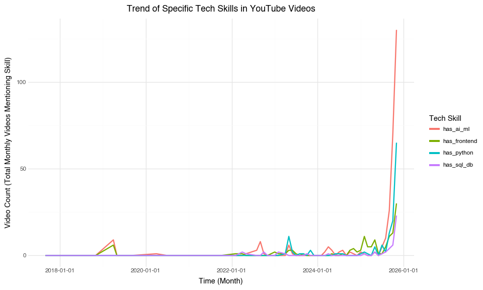

# Demonstrating Quarto for GitHub READMEs


## The Goal I Set Out to Accomplish

I want to see the most prominent topics mentioned on tech youtube videos
whether that be python coding, front end engineering, etc and how this
changes with time. Do we see an increase in certain skills over time?
Similarly, I want to pull data from dice.com and a technology job board
and see how the technical skill keywords I intendified change over time
Further, I want to imagine I am starting an education business. Based on
the youtube videos and their views, what should I focus my content on to
get maximum views and maximum profit.

### Subsection Header

Subsections are useful for breaking ideas down and adding details. This
is also likely where you’ll want to add code blocks.

It will be worth noting some chunk options that you might find useful.

If I want to hide code but show output, I can use `echo: false`.

    4

If I want to hide output but show code, I can use `results: 'hide'`.

``` python
2 + 2
```

    4

Maybe I want to show the code, but not run it. I can use `eval: false`.

``` python
2 + 2
```

In most of your chunks, you’ll probably want to turn off messages and
warnings. You might notice, though, that I did that globally in the
execute key in the header above. But if you want to do it in a specific
chunk, you can use:

## Loading in Packages and Initial Data

``` python
import pandas as pd
from plotnine import *
import numpy as np
import statsmodels.formula.api as sm
channels= pd.read_csv("/Users/lukeromes/Desktop/Personal/WranglingFinalProject/youtube_tech_channels_20251120_133753.csv")
videos = pd.read_csv("/Users/lukeromes/Desktop/Personal/WranglingFinalProject/youtube_tech_videos_20251120_133004.csv")
jobs = pd.read_csv("/Users/lukeromes/Desktop/Personal/WranglingFinalProject/dice_com-job_us_sample.csv")
```

## Merging and Keyskills:

Creating a new df called merged_data which merges the invidual youtube
channels df (channels) with the videos they created df (videos). I
connected these using the pandas merge function and preformed and inner
jpin on channel_id, which is the unique identifier for each youtube
channel.

I also created a dictionary of skills in the technology industry. I did
this so I would be able to create new columns in the original data that
indicates the number of instances each keyword is mentioned in each
video/job.

               published_at                                              title  \
    0  2025-11-18T22:47:05Z                       Most Important LTTStore Step   
    1  2025-11-18T19:20:33Z      This TV Factory is the Coolest I’ve Ever Seen   
    2  2025-11-15T06:24:56Z  The Hardest Secrets I’ve Ever Kept - WAN Show ...   
    3  2025-11-14T18:27:41Z                 Correct Way to Apply Thermal Paste   
    4  2025-11-13T13:54:48Z  Valve’s New Console and Controller - STEAM Mac...   

       has_python  has_ai_ml  has_frontend  
    0           0          0             0  
    1           0          0             0  
    2           0          0             0  
    3           0          0             0  
    4           0          0             0  

## Derived Variables

I created a new column called date in the jobs df that shows when the
job was posted. The jobs dataset was uploaded to Kaggle 8 years ago on
December 3, 2017 so this was used as my baseline. I then used the
postdate variable which included how long the job had been posted to
find the initial job posting date.

## Making Copies of Data

I made a copy of each df, merged_data and jobs. This was done so I could
reset the index allowing for comparisons to be made between the two
datasets. I also added a new column called technical skill which is the
sum of the skills columns.

## Question 1: I want to know is there a relationship between date and technical skill? Are the occurence of the technical keywords in the video descriptions related to time? Do they increase together?

I solved this by doing a simple correlation test. This returned a matrix
so I indexed to find the correlation coefficient in the matrix that
represents the relationship between keywords and date.

    Correlation coefficient between youtube videos and date is: 0.119

Going in I was expecting to see a significiant positive relationship
between the apperance of key technical words identified above and date
of the techology youtube videos. I was expecting this initially as
online learning has become very popular with bootcamps, individuals
making career pivots, and all the hype in the data science/technology
industry. After doing a simple correlation test it was found that the
correlation between the occurence of the keywords and date is only .119.
This value shows a weak positive trend between technical skill keyword
apperances in videos and date of videos. A possible cause of this low
correlation is the privitization of the learning community. Many
companies are creating their own paid learning platforms for learning
these new skills, which then as a result decreases the amount of videos
on youtube and youtube content creators ambition to create them.

## Question 2: I want to know is there a relationship between date and technical skill? Are the occurences of the technical keywords in the jobskills related to time? Do they increase together?

I solved this by doing a simple correlation test. This returned a matrix
so I indexed to find the correlation coefficient in the matrix that
represents the relationship between keywords and date.

    Correlation coefficient between required job skills and date: -0.045

Like mentioned above, I was going in expecting to see a strong
relationship between date and technical skill keywords as the technology
is evolving requiring individuals to be much more technical than ever
before. Further, the job marker is ultra-competitive requiring
individuals to be proficient in a multitude of different skills. After
running the correlation test, it was found that the correlation between
these two variables is only -0.045 suggesting that the two variables are
not linearly related and, in fact, exhibit a very weak negative trend.
The frequency of these keywords appears to slightly decline over time.

## Question 3: How does the occurence of key words change over time in youtube videos?

Converting the merged data (youtube data) to long format to help with
plotting and aggregating by the monthly level to better see trends.

<div>
<style scoped>
    .dataframe tbody tr th:only-of-type {
        vertical-align: middle;
    }
&#10;    .dataframe tbody tr th {
        vertical-align: top;
    }
&#10;    .dataframe thead th {
        text-align: right;
    }
</style>

|     | time       | Skill        | Video_Count | month_label |
|-----|------------|--------------|-------------|-------------|
| 0   | 2017-09-01 | has_ai_ml    | 0           | 2017-09     |
| 1   | 2017-09-01 | has_frontend | 0           | 2017-09     |
| 2   | 2017-09-01 | has_python   | 0           | 2017-09     |
| 3   | 2017-09-01 | has_sql_db   | 0           | 2017-09     |
| 4   | 2017-10-01 | has_ai_ml    | 0           | 2017-10     |

</div>

### Plotting Youtube Videos

``` python
(
    ggplot(youtube_monthly_trend, aes(x='time', y='Video_Count', color='Skill'))
    + geom_line(size=1)
    + labs(
        title='Trend of Specific Tech Skills in YouTube Videos',
        x='Time (Month)',
        y='Video Count (Total Monthly Videos Mentioning Skill)',
        color='Tech Skill'
    )
    + theme_minimal()
    + theme(figure_size=(10, 6))
)
```



The results from this plot are no surprise, the AI/ML craze is definetly
real and evident. In the graph we can see that towards the middle of
2025,the amount of AI/ML related youtube videos skyrocketed. This is
likely due to everyone wanting to get in on this area and the rise of
online bootcamps. It is also interesting to see how front end
development skills such as HTML, CSS, react are less important now due
to agentic AI replacing much of the careers in this industry. This then
lowers the amount of people interested in watching these videos hence
less creators make these front end videos.

## Question 4: How does the occurence of key words change over time in job skill descriptions?

Converting Job data to long

<div>
<style scoped>
    .dataframe tbody tr th:only-of-type {
        vertical-align: middle;
    }
&#10;    .dataframe tbody tr th {
        vertical-align: top;
    }
&#10;    .dataframe thead th {
        text-align: right;
    }
</style>

|     | time       | Skill        | Job_Count | month_label |
|-----|------------|--------------|-----------|-------------|
| 0   | 2017-11-01 | has_ai_ml    | 20        | 2017-11     |
| 1   | 2017-11-01 | has_frontend | 859       | 2017-11     |
| 2   | 2017-11-01 | has_python   | 341       | 2017-11     |
| 3   | 2017-11-01 | has_sql_db   | 1219      | 2017-11     |
| 4   | 2017-12-01 | has_ai_ml    | 44        | 2017-12     |

</div>

### Plotting Jobs

``` python
(
    ggplot(jobs_monthly_trend, aes(x='time', y='Job_Count', color='Skill'))
    + geom_line(size=1)
    + labs(
        title='Trend of Certain Skills in Job Postings',
        x='Time (Month)',
        y='Job Count of Apperances of Keywords',
        color='Tech Skill'
    )
    + theme_minimal()
    + theme(figure_size=(10, 6))
)
```


This graph shows the relationship between the technical skills outlined
above and their prominence in job skills section of job postings. It is
interesting to note the rise of SQL/DB knowledge. This rise really began
to come to life in 2017, when the field of data science began to take
root as an up and coming industry. This led to unprecedented amounts of
data and as a result companies needed skilled people to be able to
manage, organize, and extract it.

This job data is lagged behind as it only includes 2017, whileas the
youtube video data contains data up until Novemeber of 2025. It is
interesting to see how the importance of different skills has changed
throughout the years, in 2017, knowing SQL and some basic front end such
as HTML, CSS was plenty to land you a great job in the technology field
while today the focus on technical skills has shifted more towards
machine learning, artificial intelligence, and python.

## Question 5: Further, I want to imagine I am starting an education business. Based on the youtube videos and their views, what should I focus my content on? I know from the graphs above, python and machine learning are heavily saturated topics on the technology side of youtube.

To find find out which topic I should focus on to get the most views to
bring in the most profit I decided to just run a simple linear
regression to see which variables had a significant impact on the
outcome, in this case views.

``` python
model = sm.ols(formula = 'views ~ has_python + has_ai_ml + has_frontend + has_sql_db + technical_skill', data = merged_data_new).fit()
model.summary()
```

|                   |                  |                     |           |
|-------------------|------------------|---------------------|-----------|
| Dep. Variable:    | views            | R-squared:          | 0.001     |
| Model:            | OLS              | Adj. R-squared:     | -0.002    |
| Method:           | Least Squares    | F-statistic:        | 0.4487    |
| Date:             | Wed, 03 Dec 2025 | Prob (F-statistic): | 0.773     |
| Time:             | 15:34:41         | Log-Likelihood:     | -20886.   |
| No. Observations: | 1300             | AIC:                | 4.178e+04 |
| Df Residuals:     | 1295             | BIC:                | 4.181e+04 |
| Df Model:         | 4                |                     |           |
| Covariance Type:  | nonrobust        |                     |           |

OLS Regression Results

|                 |            |          |        |          |           |          |
|-----------------|------------|----------|--------|----------|-----------|----------|
|                 | coef       | std err  | t      | P\>\|t\| | \[0.025   | 0.975\]  |
| Intercept       | 1.782e+05  | 7.84e+04 | 2.273  | 0.023    | 2.44e+04  | 3.32e+05 |
| has_python      | -7.982e+04 | 2.16e+05 | -0.370 | 0.712    | -5.03e+05 | 3.44e+05 |
| has_ai_ml       | -9.771e+04 | 1.45e+05 | -0.673 | 0.501    | -3.82e+05 | 1.87e+05 |
| has_frontend    | 1.62e+05   | 2.03e+05 | 0.796  | 0.426    | -2.37e+05 | 5.61e+05 |
| has_sql_db      | -3.301e+04 | 3.2e+05  | -0.103 | 0.918    | -6.61e+05 | 5.95e+05 |
| technical_skill | -4.858e+04 | 8.2e+04  | -0.593 | 0.554    | -2.09e+05 | 1.12e+05 |

|                |          |                   |              |
|----------------|----------|-------------------|--------------|
| Omnibus:       | 3559.653 | Durbin-Watson:    | 1.964        |
| Prob(Omnibus): | 0.000    | Jarque-Bera (JB): | 65761772.325 |
| Skew:          | 32.229   | Prob(JB):         | 0.00         |
| Kurtosis:      | 1102.958 | Cond. No.         | 1.51e+15     |

<br/><br/>Notes:<br/>[1] Standard Errors assume that the covariance matrix of the errors is correctly specified.<br/>[2] The smallest eigenvalue is 8.45e-28. This might indicate that there are<br/>strong multicollinearity problems or that the design matrix is singular.

From the model it is evident that it does not matter which technical
skill I focus on for creating my videos, none of them have a significant
impact on the total number of views. This is surprising and yet makes
sense as usually those who watch videos on youtube know exactly what
they are looking for and with the rise of technical expertise, every
area in the technology field needs to be mastered, hence a more even
distribution.
